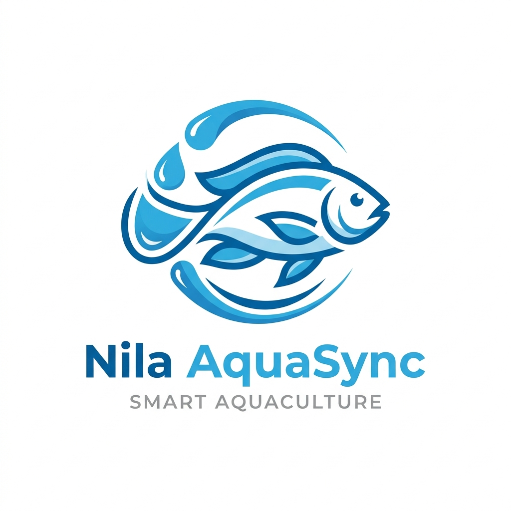
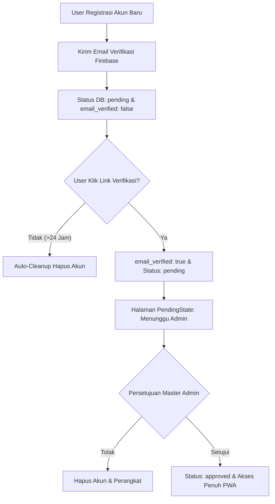

<div align="center">

  

  # 🐟 Nila AquaSync
  ### Smart Water Quality Monitoring & Control System for Tilapia Farming

  [](https://react.dev/)
  [](https://firebase.google.com/)
  [](https://vitejs.dev/)
  [](https://web.dev/progressive-web-apps/)

  <p align="center">
    Aplikasi <b>Progressive Web App (PWA)</b> modern untuk pemantauan tingkat kekeruhan air kolam ikan nila secara real-time (NTU), dilengkapi dengan klasifikasi kejernihan 4 tingkat, kontrol otomatisasi aktuator, proteksi verifikasi email 24-jam & persetujuan admin, serta laporanPDF resmi.
  </p>

</div>

---

## 📌 Fitur Utama

- 🌊 **Monitoring Kekeruhan Real-time (NTU)**: Menampilkan pembacaan sensor kekeruhan air detik demi detik dengan visual meter bar.
- 🎯 **Klasifikasi Kejernihan 4 Tingkat**:
  - 🟢 **Jernih**: `≤ 25 NTU` *(Kondisi ideal budidaya)*
  - 🔵 **Agak Keruh**: `26 - 45 NTU` *(Kekeruhan ringan, kondisi aman)*
  - 🟡 **Keruh**: `46 - 65 NTU` *(Sirkulasi filter aktif)*
  - 🔴 **Sangat Keruh**: `≥ 65 NTU` *(Perlu pengurasan dasar kolam)*
- ⚙️ **Pengaturan Ambang Batas Dinamis**: User dapat secara bebas menentukan dan menyimpan batas NTU untuk masing-masing dari 4 klasifikasi.
- 🎛️ **Kontrol Aktuator Kolam**:
  - Sakelar **Pompa Dosing PAC (Bahan Penjernih)** (ON/OFF) untuk penambahan cairan Poly Aluminium Chloride.
  - Mode Operasional **Otomatis (ESP32)** vs **Manual User**.
- 🛡️ **Keamanan Terverifikasi 3-Lapis**:
  1. *Autentikasi Firebase Email & Password*.
  2. *Verifikasi Email 24-Jam (dengan sistem auto-cleanup akun spam)*.
  3. *Persetujuan Akses oleh Master Admin*.
- 👨‍⚖️ **Dashboard Master Admin**:
  - Ringkasan statistik (User Aktif, Antrean Pendaftar, Total Alat).
  - Manajemen User: **Setujui / Tolak / Edit / Hapus Pengguna**.
  - Manajemen Perangkat & Penanganan Tiket Pengaduan.
- 📄 **Ekspor Laporan PDF**: Cetak dan unduh dokumen laporan riwayat kualitas air kolam secara resmi.
- 📲 **PWA & Mobile-First Design**:
  - Desain **Neumorphic Glass 3D UI** dengan palet warna *Deep Ocean Blue*.
  - Tampilan **Horizontal Swipe Carousel** responsif untuk smartphone.
  - Dapat diinstall di Android, iOS, & Desktop sebagai aplikasi standalone.

---

## 🏗️ Arsitektur Alur Autentikasi & Keamanan



---

## 🛠️ Teknologi & Dependensi

| Kategori | Teknologi | Deskripsi |
| :--- | :--- | :--- |
| **Core Framework** | React 19.0 | Library UI Deklaratif Berbasis Komponen |
| **Build Tool** | Vite 8.0 | Dev Server Super Cepat & Bundler Produksi |
| **Backend & Auth** | Firebase 12.0 | Firebase Auth & Realtime Database |
| **Routing** | React Router v7 | Manajemen Rute SPA & Proteksi Akses |
| **PWA Support** | Vite Plugin PWA | Service Worker Auto-update & Web Manifest |
| **Grafik & Chart** | Recharts 3.10 | Visualisasi Grafik Line Chart Real-time |
| **Cetak Laporan** | jsPDF & AutoTable | Generator Dokumen Laporan PDF |
| **Desain & UI** | Vanilla CSS 3D | Custom Neumorphic & Claymorphic Ocean Theme |
| **Icons & Alert** | Lucide React & SweetAlert2 | Ikon Vektor Modern & Modal Pop-up Interaktif |

---

## 🚀 Panduan Instalasi & Jalankan Lokal

### 1. Prasyarat
- [Node.js](https://nodejs.org/) (Versi 18 atau lebih baru)
- [Git](https://git-scm.com/)

### 2. Clone Repositori
```bash
git clone https://github.com/Antares023/aquasync.git
cd aquasync
```

### 3. Install Dependensi
```bash
npm install
```

### 4. Konfigurasi Environment (`.env`)
Salin file `.env.example` menjadi `.env` lalu ganti nilai variabel dengan kredensial proyek Firebase Anda:

```bash
cp .env.example .env
```

Isi file `.env`:
```env
VITE_FIREBASE_API_KEY=your_api_key_here
VITE_FIREBASE_AUTH_DOMAIN=your_project_id.firebaseapp.com
VITE_FIREBASE_DATABASE_URL=https://your_project_id-default-rtdb.firebaseio.com
VITE_FIREBASE_PROJECT_ID=your_project_id
VITE_FIREBASE_STORAGE_BUCKET=your_project_id.appspot.com
VITE_FIREBASE_MESSAGING_SENDER_ID=your_messaging_sender_id
VITE_FIREBASE_APP_ID=your_app_id
```

### 5. Deployment Rules Firebase Realtime Database
Salin isi file [`database.rules.json`](database.rules.json) ke tab **Rules** pada Realtime Database di Firebase Console Anda.

### 6. Jalankan Dev Server
```bash
npm run dev
```
Buka browser di `http://localhost:5173`.

### 7. Build Produksi
```bash
npm run build
```

---

## 🗄️ Struktur Realtime Database Firebase

```json
{
  "users": {
    "$uid": {
      "email": "user@gmail.com",
      "name": "Nama User",
      "phone": "08123456789",
      "institution": "Kolam Blok A",
      "role": "user", // "master_admin" | "user"
      "status": "approved", // "pending" | "approved"
      "email_verified": true,
      "created_at": 1740000000000
    }
  },
  "devices": {
    "$deviceId": {
      "owner_uid": "$uid",
      "name": "Kolam Nila Utama",
      "last_updated": 1740000000000,
      "sensor_data": {
        "ntu": 18.5
      },
      "settings": {
        "threshold_jernih": 25,
        "threshold_agak_keruh": 45,
        "threshold_keruh": 65,
        "threshold_sangat_keruh": 85
      },
      "controls": {
        "mode": "auto",
        "pump_pac": false,
        "reset_wifi": false
      }
    }
  }
}
```

---

## 👨‍💻 Kontributor & Lisensi

Dikembangkan oleh **[Antares023](https://github.com/Antares023)**.

Lisensi di bawah **[MIT License](LICENSE)**. Bebas digunakan dan dikembangkan untuk keperluan akademis & penelitian budidaya perikanan.
